# Online Quiz Maker 🎓 — AI-Powered Assessment & Learning Platform

[](https://react.dev/)
[](https://vitejs.dev/)
[](https://nodejs.org/)
[](https://expressjs.com/)
[](https://www.mongodb.com/atlas)
[](https://ai.google.dev/)
[](LICENSE)

An enterprise-grade, full-stack educational assessment platform built with **React 18 (Vite)**, **Node.js**, **Express**, **MongoDB Atlas**, and **Google Gemini Generative AI**.

Designed not merely as a simple trivia app, but as a complete **Pedagogical Mastery Platform** featuring strict exam scheduling, automated deadline enforcement, academic integrity locks, teacher classroom gradebooks, and multimodal AI quiz generation.

---

## 🔄 The 5-Stage Pedagogical Mastery Loop

```
                             [ QuizMaker Ecosystem ]
                                        │
    ┌──────────────┬────────────────────┼────────────────────┬──────────────┐
    ▼              ▼                    ▼                    ▼              ▼
 [1. CREATE]  [2. PRACTICE]         [3. LEARN]          [4. ANALYZE]   [5. IMPROVE]
  • Author      • Untimed &         • "Why It's          • SVG Trajectory • Auto-detects
    manual or     self-paced          Correct" vs          chart with     weak subjects
    AI quizzes  • Instant             "Not quite"          Y-axis marks • 1-click
  • Assign        feedback          • Concept trails    • Score aggreg-   targeted
    students    • 1-click retry       and hierarchy       ations across   remediation
  • Schedule    • Unlocked post-      breakdowns          categories      launchpad
    windows       exam deadline
```

---

## 🌟 Standout Features & Architectural Highlights

### 1. 🤖 Multimodal AI Quiz Generator (Google Gemini 3.5 Flash)
- **3 Input Modalities:** Generate structured quizzes from:
  1. **Topic:** Any subject or academic field (e.g., *Quantum Computing*, *Docker Microservices*).
  2. **Text / Notes:** Paste study material, articles, or lecture notes for in-context grounded generation.
  3. **Vision / Images:** Upload diagrams, circuit diagrams, or textbook snapshots.
- **Fail-Safe Resilience:** Features an automated fallback synthesis engine that algorithmically creates curriculum-aligned questions even if network connectivity or API tokens fluctuate.

### 2. 🎯 Student Whitelisting & Private Assignments
- **Restricted Attendance:** Quiz authors can whitelist specific students by email (`assignedEmails`).
- **Privacy Enforcement:** Private quizzes are strictly visible **only** to the author and the designated students, hidden from public explore feeds.
- **Student Hub:** Assigned exams appear highlighted in a dedicated **"🎯 Exams Assigned to You"** section on the student's dashboard.

### 3. ⏳ Scheduled Exam Windows & Automated 0-Mark Submission
- **Strict Timeframes:** Instructors can configure an `examStartTime` and `examEndTime`.
- **Pre-Exam Guard:** Visiting an exam before `examStartTime` displays an **"Exam Not Started Yet"** countdown screen.
- **Automated Deadline Penalty:** If a student does not attend or complete the exam before `examEndTime`, the server automatically submits the attempt with **0 marks** (`isExpired: true`, `submissionReason: 'exam_window_expired'`).

### 4. 🔒 Academic Integrity Practice Mode Lock
- **Anti-Cheating Protection:** For scheduled exams, **Practice Mode is strictly locked** before and during the exam window to prevent students from previewing questions and answers.
- **Post-Exam Unlocking:** Practice Mode **automatically unlocks strictly after the exam deadline** has passed, enabling students to study the questions, review instant feedback, and learn without affecting their official grade.

### 5. 📊 Instructor Classroom Gradebook & CSV Export
- **Comprehensive Class Overview:** Accessible by quiz authors to view all enrolled submissions, percentages, pass/fail status, and time spent.
- **Expired Flags:** Clearly tags auto-submitted attempts with `⚠️ Window Expired` and `0% (Auto 0)`.
- **Question-by-Question Diagnostics:** View each student's exact choice vs. the correct answer.
- **1-Click CSV Export:** Export complete classroom grades directly into Excel/Google Sheets.

### 6. 📈 Zero-Dependency SVG Performance Curve & Weakness Detection
- **Native SVG Trajectory:** Hand-crafted cubic Bezier curve tracking historical scores over time with dynamic Y-axis tick marks—zero charting library bloat.
- **Automated Gap Analysis:** Aggregates attempt history to detect the user's lowest-scoring subject and presents an **"Analyze & Improve"** banner for targeted practice.

---

## 📸 Visual Tour & Application Screenshots

### 1. Hero Landing & Multimodal AI Quiz Generator
| **Hero Landing Page** | **Multimodal AI Quiz Generator (Gemini 3.5 Flash)** |
|:---:|:---:|
| 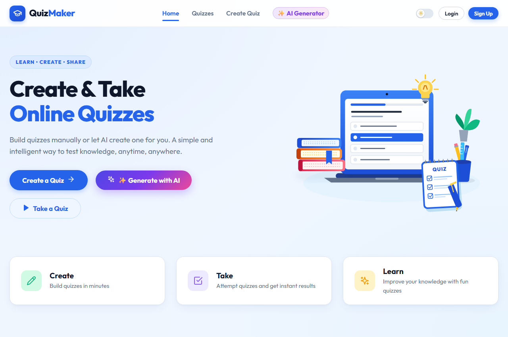 | 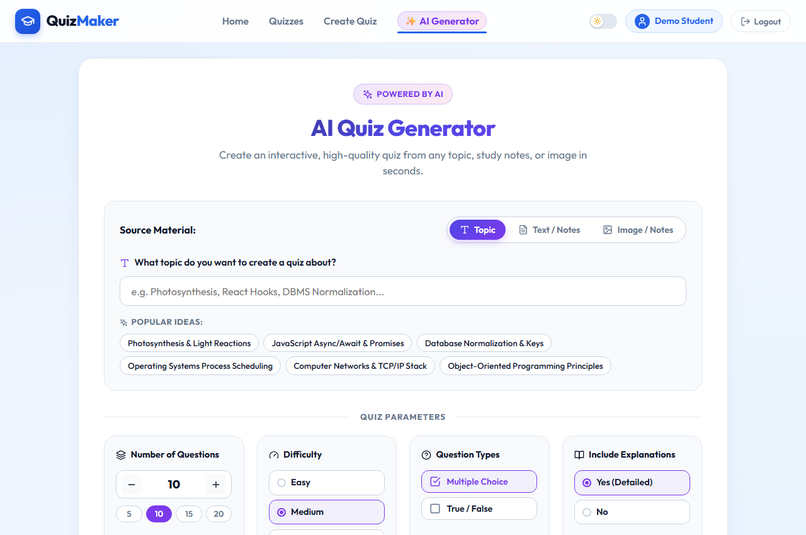 |
| *Modern educational landing page with feature highlights and one-click demo login.* | *Generate quizzes from Topics, pasted study notes, or uploaded textbook diagrams.* |

---

### 2. Catalog & Exam Scheduling Administration
| **Explore Quizzes & Badges** | **Exam Window & Student Whitelist Scheduler** |
|:---:|:---:|
| 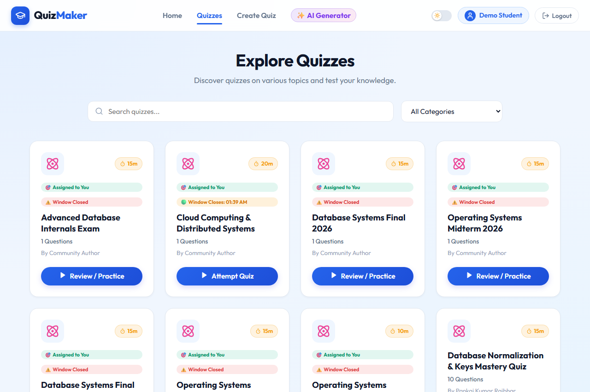 | 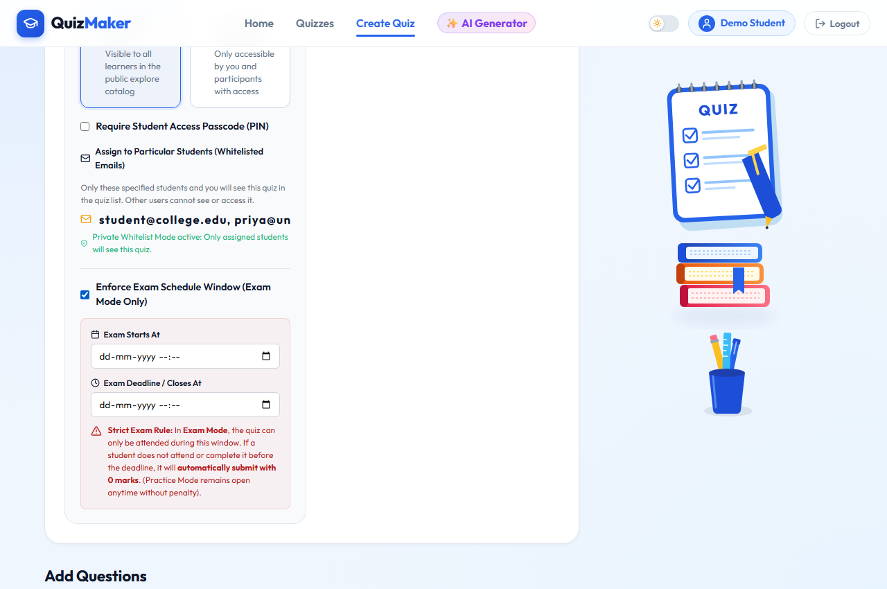 |
| *Real-time badges: 🎯 Assigned to You, 🟢 Active Window, ⏳ Starts Soon, ⚠️ Window Closed.* | *Instructor tools: email whitelist assignment and strict start/end schedule window.* |

---

### 3. Dual-Mode Arena & Academic Integrity Enforcement
| **Practice & Learn Mode Arena** | **Academic Integrity: Practice Mode Locked** |
|:---:|:---:|
| 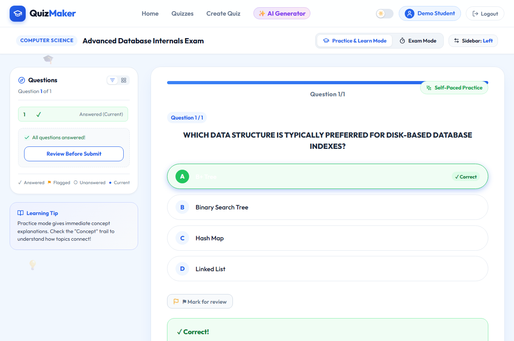 | 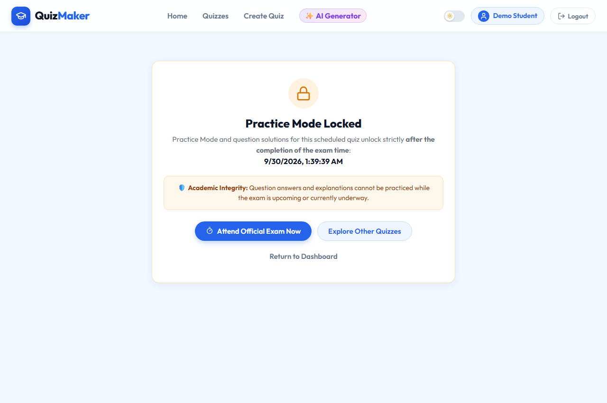 |
| *Self-paced learning with instant distractor feedback and concept trails.* | *Practice mode is strictly locked during an active exam to prevent premature answer leaks.* |

---

### 4. Automated Deadline Enforcement & Results
| **Auto-0 Marks Expired Exam Guard** | **Instructor Classroom Gradebook & CSV** |
|:---:|:---:|
| 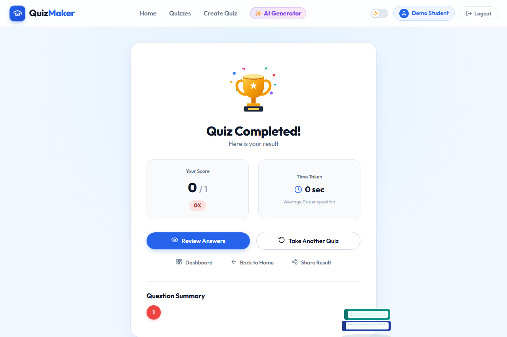 | 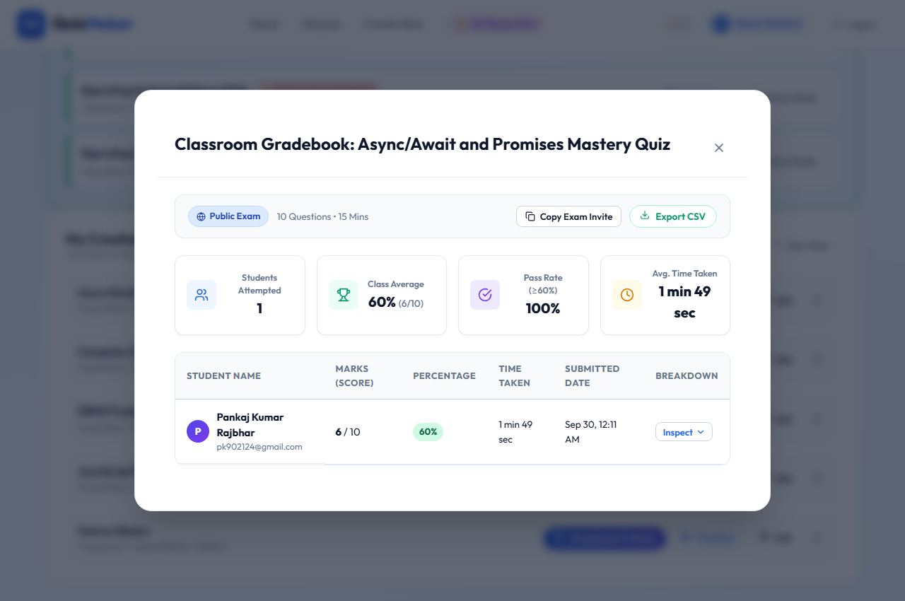 |
| *Strict deadline policy: non-attendance or overdue exams submit with 0 marks.* | *Full roster gradebook with submission status, question breakdown, and CSV export.* |

---

### 5. Continuous Learning Dashboard
<p align="center">
  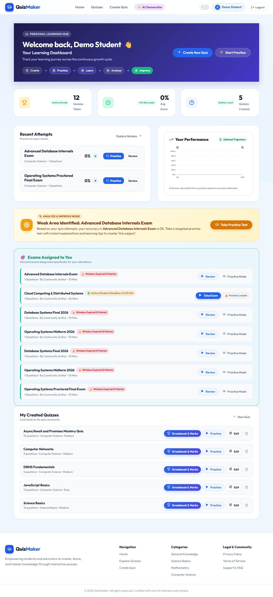
</p>
<p align="center">
  <em>Personal Learning Dashboard featuring "🎯 Exams Assigned to You", native Bezier SVG performance progression curve, recent attempt analysis, and 1-click targeted remediation.</em>
</p>

---

## 🏗️ System Architecture Diagram

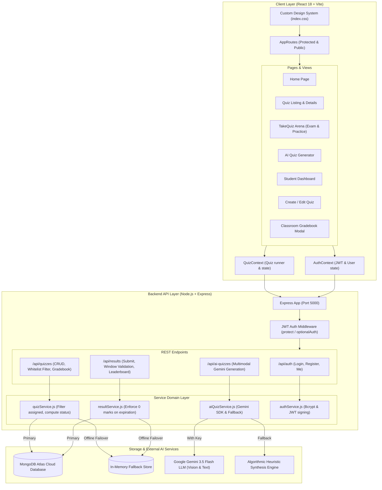

---

## ⏱️ Exam Scheduling & Practice Locking Sequence Flow

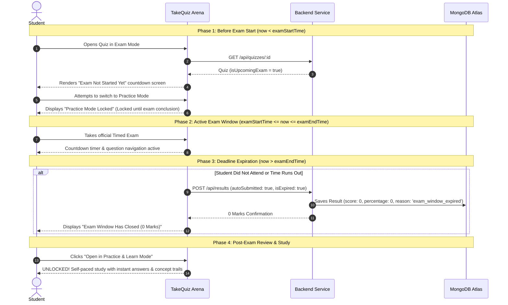

---

## 🤖 Multimodal AI Generation Workflow

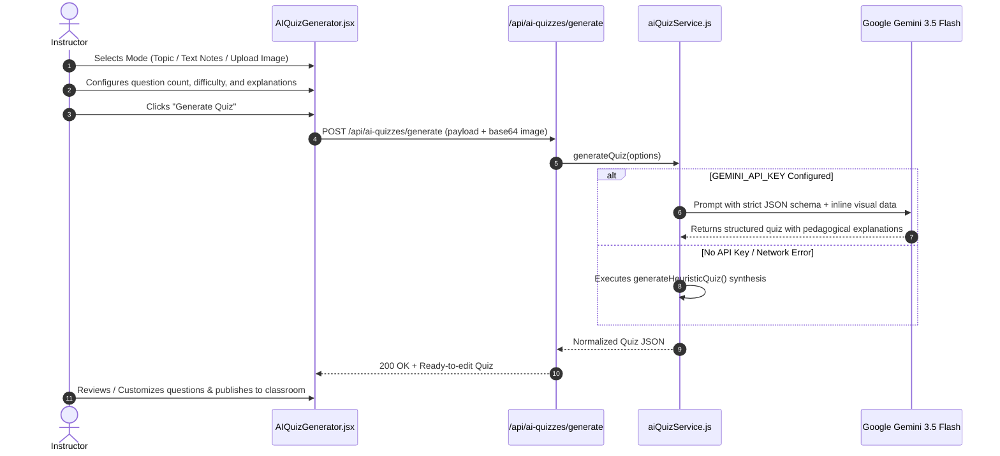

---

## 📁 Repository Directory Structure

```
online-quiz-maker/
├── client/                                 # React Frontend (Vite)
│   ├── public/                             # Public static assets & favicon
│   ├── src/
│   │   ├── assets/
│   │   │   ├── icons/CategoryIcons.jsx     # Dynamic category iconography
│   │   │   └── illustrations/              # Custom SVG vectors & artwork
│   │   ├── components/
│   │   │   ├── common/                     # Button, Modal, Loader, ErrorBoundary
│   │   │   ├── layout/Navbar.jsx           # Main navigation & user menu
│   │   │   ├── quiz/                       # QuestionCard, QuestionNavigator, QuizTimer
│   │   │   └── results/GradebookModal.jsx  # Instructor classroom gradebook & CSV
│   │   ├── context/
│   │   │   ├── AuthContext.jsx             # Authentication & user state
│   │   │   └── QuizContext.jsx             # Active quiz runner & submission state
│   │   ├── hooks/useQuiz.js                # Quiz state management hook
│   │   ├── pages/
│   │   │   ├── AIGenerator/AIQuizGenerator.jsx # Gemini multimodal quiz creation
│   │   │   ├── Auth/                       # Login & Register pages
│   │   │   ├── CreateQuiz/                 # Manual quiz authoring & edit
│   │   │   ├── Dashboard/Dashboard.jsx     # Learning stats & assigned exams
│   │   │   ├── Home/Home.jsx               # Hero landing page & features
│   │   │   ├── Quizzes/TakeQuiz.jsx        # Dual-mode interactive arena
│   │   │   └── Results/QuizResult.jsx      # Score card & concept review
│   │   ├── services/                       # API client services
│   │   ├── App.jsx                         # Main React application shell
│   │   └── index.css                       # Comprehensive modern CSS design system
│   ├── package.json
│   └── vite.config.js
│
├── server/                                 # Node.js + Express Backend API
│   ├── src/
│   │   ├── config/db.js                    # MongoDB Atlas & in-memory fallback
│   │   ├── controllers/
│   │   │   ├── aiQuizController.js         # Gemini AI quiz generation controller
│   │   │   ├── authController.js           # JWT authentication controller
│   │   │   ├── quizController.js           # Quiz CRUD, whitelist & scheduling
│   │   │   └── resultController.js         # Quiz submission & gradebook controller
│   │   ├── middleware/
│   │   │   ├── authMiddleware.js           # JWT protect & optionalAuth
│   │   │   └── errorMiddleware.js          # Centralized error handler
│   │   ├── models/
│   │   │   ├── Quiz.js                     # Quiz schema (schedule, assignedEmails)
│   │   │   ├── Result.js                   # Result schema (isExpired, scores)
│   │   │   └── User.js                     # User account schema
│   │   ├── routes/                         # Express API routes
│   │   ├── services/
│   │   │   ├── aiQuizService.js            # Gemini API & candidate model loop
│   │   │   ├── quizService.js              # Business logic & access filtering
│   │   │   └── resultService.js            # Score & expired submission logic
│   │   ├── utils/quizPrompt.js             # Pedagogical prompts & heuristic engine
│   │   ├── app.js                          # Express app configuration
│   │   └── server.js                       # Server entry point
│   ├── .env.example                        # Template for environment configuration
│   └── package.json
│
├── .gitignore                              # Git exclusion rules (safeguards secrets)
├── package.json                            # Root concurrent workspace scripts
└── README.md                               # Project documentation
```

---

## 📡 REST API Reference

| Method | Endpoint | Description | Access |
| :--- | :--- | :--- | :--- |
| `POST` | `/api/auth/register` | Register a new user | Public |
| `POST` | `/api/auth/login` | Authenticate & receive JWT token | Public |
| `GET` | `/api/auth/me` | Fetch authenticated user profile | Private |
| `GET` | `/api/quizzes` | List accessible quizzes (filters assigned quizzes) | Public / Optional |
| `GET` | `/api/quizzes/:id` | Fetch quiz details & schedule metadata | Public / Optional |
| `POST` | `/api/quizzes` | Create quiz with schedule window & whitelist | Private |
| `PUT` | `/api/quizzes/:id` | Update an authored quiz | Private (Author) |
| `DELETE` | `/api/quizzes/:id` | Delete an authored quiz | Private (Author) |
| `GET` | `/api/quizzes/:id/gradebook` | Fetch student grades roster & question breakdown | Private (Author) |
| `POST` | `/api/results` | Submit quiz attempt (enforces 0 on expired window) | Private |
| `GET` | `/api/results/my-results` | Retrieve personal attempt history | Private |
| `GET` | `/api/results/:id` | Fetch specific result breakdown | Private |
| `POST` | `/api/ai-quizzes/generate` | Generate quiz via Gemini 3.5 Flash (topic/text/image) | Public / Private |

---

## 🛠️ Quick Start & Installation

### Prerequisites
- [Node.js](https://nodejs.org/) (v18 or higher)
- [MongoDB](https://www.mongodb.com/) (Local instance or free MongoDB Atlas URI)
- *(Optional)* [Google AI Studio Gemini API Key](https://aistudio.google.com/) for live AI quiz generation.

### 1. Clone the repository
```bash
git clone https://github.com/pankaj332004/CODESOFT_TASK_2.git
cd CODESOFT_TASK_2
```

### 2. Install all dependencies
```bash
npm run install:all
```
*(This automatically installs dependencies for both the `client` and `server` folders).*

### 3. Configure Environment Variables

Create a `.env` file in the `server/` directory:
```bash
cp server/.env.example server/.env
```

Edit `server/.env`:
```env
PORT=5000
MONGODB_URI=mongodb+srv://<username>:<password>@cluster0.mongodb.net/quiz_maker?retryWrites=true&w=majority
JWT_SECRET=your_jwt_secret_key_here
NODE_ENV=development
CLIENT_URL=http://localhost:5173

# Optional: Real Google Gemini LLM Integration
GEMINI_API_KEY=your_gemini_api_key_here
GEMINI_MODEL=gemini-3.5-flash
```

### 4. Run the Application

Start both the backend server and frontend client concurrently with a single command:
```bash
npm run dev
```

- **Frontend Application:** `http://localhost:5173`
- **Backend API:** `http://localhost:5000`

---

## 📄 License
This project is open-source and available under the [MIT License](LICENSE).
